# SrujanaBuddy — Leadership Demo
**REVA University AI Coaching Companion**  
May 14, 2026 · First Floor Boardroom, Admin Block

#

> **आचार्यात् पादमादत्ते पादं शिष्यः स्वमेधया ।**
> **पादं सब्रह्मचारिभ्यः पादं कालक्रमेण च ॥**

---

# SrujanaBuddy
## REVA University's AI Coaching Companion

**A Leadership Demonstration**
May 14, 2026 · First Floor Boardroom, Admin Block

*Augmenting Faculty Mentoring at Scale*

---

# Agenda

| Time | Session |
|------|---------|
| 15 min | **Software 3.0 & Agent Skills** — The Revolution in Plain Language |
| 5 min | **SrujanaBuddy** — Architecture & Coach Identity |
| 15 min | **Live Demo** — Student Experience Walkthrough |
| 15 min | **Feedback & Q&A** |
| 10 min | **Action Planning** — Beta Testers & Next Steps |

> *You choose which demo scenarios to see — pick from 10 real student situations.*

---

# Part 1: Software 3.0 & Agent Skills

## The Revolution — In Plain Language

*For non-technical leadership: what changed, and why it matters now*

---

# How Software Evolved

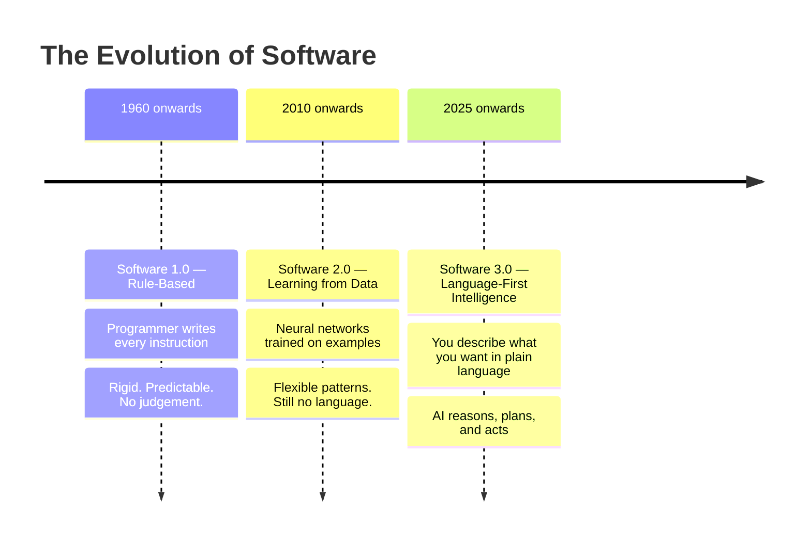

> *We moved from "tell the computer every step" to "describe the goal and the AI figures out the steps."*

---

# The Analogy — In Simple Terms

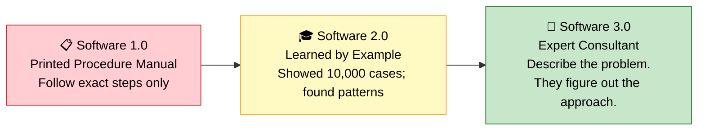

### The shift:
- **Old:** You tell the computer every step. It breaks if one step changes.
- **New:** You describe intent. The AI reasons. It adapts.

---

# What Are "Agent Skills"?

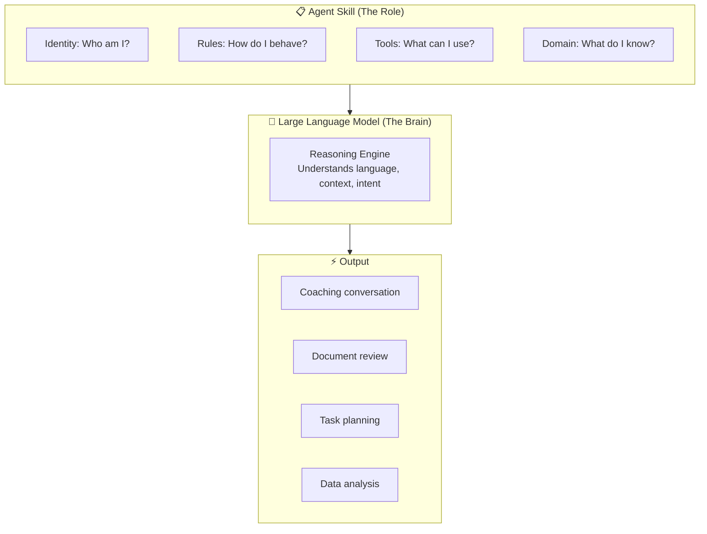

> **An Agent Skill = Instructions that give the AI a specific role, domain knowledge, and behavioural rules.**
> Like giving a brilliant generalist a detailed job description.

---

# One Model. Infinite Specialists.

> 📌 *🖼️ INFOGRAPHIC PLACEHOLDER: Show one brain → 15 specialist hats (coach, auditor, researcher, admin, mentor...)*

### Why this is revolutionary:
- **No new software** to install or maintain
- **No new servers** — runs in the tools you already use (GitHub Copilot, VS Code, Gemini)
- **Instantly update** expertise by editing a text file
- **Any domain** — the same approach works for coaching, legal review, research, admin

> *You are not buying software. You are writing role descriptions for an AI that already exists.*

---

# T.R.A.C.K — Automation Across REVA

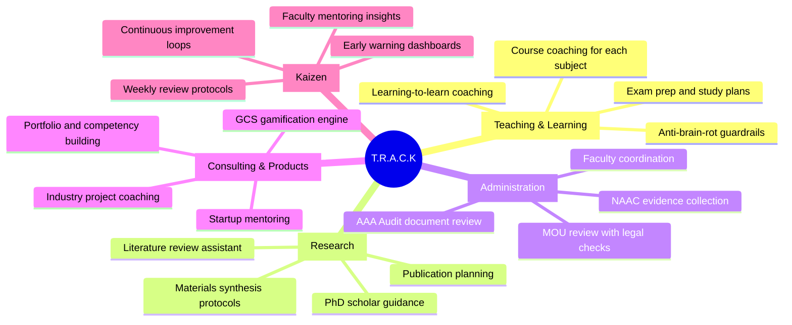

---

# T.R.A.C.K — Real Examples Today

| Domain | What an Agent Skill Can Do |
|--------|---------------------------|
| **Teaching (T)** | Coach a student through exam panic at 11pm — no faculty needed |
| **Research (R)** | Guide a PhD scholar on materials synthesis from published papers |
| **Administration (A)** | Review an MOU against REVA's legal checklist — flag gaps instantly |
| **Consulting (C)** | Score a student's startup idea across 6 Enterprising dimensions |
| **Kaizen (K)** | Run weekly coaching reviews and flag at-risk students to faculty |

> 📌 *🖼️ MEME PLACEHOLDER: "It's not about replacing faculty — it's about giving faculty superpowers."
(Suggest: Professor with Iron Man suit)*

---

# The Key Insight for Leadership

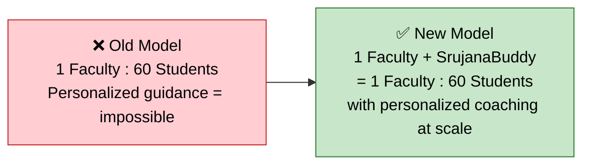

### SrujanaBuddy is not a chatbot.
It is a **coaching operating system** — 160 files, 15,000 lines of REVA-specific coaching intelligence — built on Agent Skills technology.

> *The same platform that can coach students can review MOUs, guide PhD research, support NAAC audits, and run Kaizen reviews. Same technology. Different skill files.*

---

# Part 2: SrujanaBuddy

## Architecture & Coach Identity

---

# What Is SrujanaBuddy?

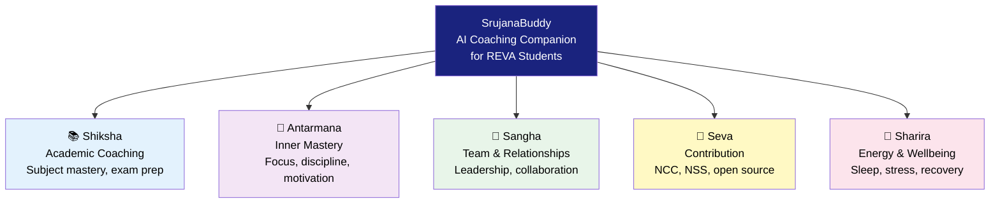

*Five Spheres (Panchakosha) — whole-person coaching, not just grades.*

---

# Architecture: How It Routes

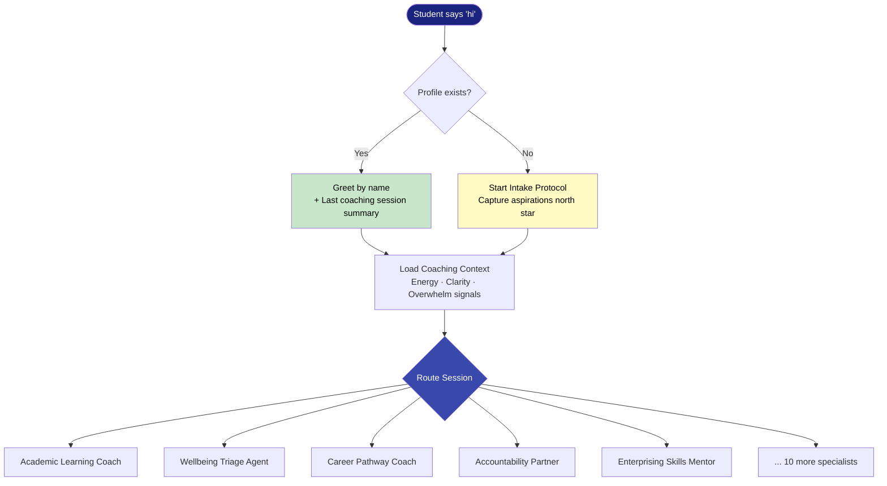

---

# 15 Specialist Agents

| # | Agent | Who It Serves |
|---|-------|--------------|
| 1 | Academic Learning Coach | Study strategy, subject mastery |
| 2 | Course Buddy (per subject) | Per-course deep coaching |
| 3 | Assessment & Competition Coach | Exams, hackathons, competitions |
| 4–5 | Accountability + GTD Partner | Daily/weekly execution discipline |
| 6 | Inner Mastery Coach | Focus, discipline, dopamine regulation |
| 7 | Integral Life Coach | Whole-person balance |
| 8 | Career & Pathway Coach | Job/internship/GATE/startup direction |
| 9 | Competency & Portfolio Coach | Portfolio for placements and admissions |
| 10 | Out-of-Curriculum Coach | Certifications, personal projects |
| 11 | Enterprising Skills Mentor | GCS, startup ideas, venture readiness |
| 12–15 | Support, Faculty Coord, History, Website | Safety, escalation, evidence, presence |

---

# The Srujana Pathway

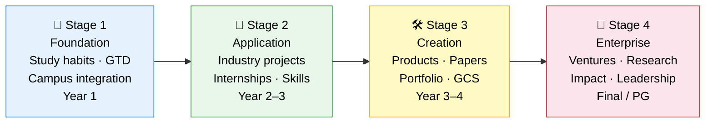

*Readiness-based progression, not semester-gated. Evidence-first.*

---

# Part 3: Live Demo

## 10 Student Scenarios — You Choose

*Select any scenario below. We will walk through it live.*

---

# Choose Your Demo

| # | Student | Situation | What You'll See |
|---|---------|-----------|-----------------|
| 1 | **Riya** — 1st yr CSE | Exam panic, blank brain | Wellbeing triage · Calm Queen reset |
| 2 | **Arjun** — 3rd yr CSE | AI vs Startup dilemma | Career coaching · Svadharma discovery |
| 3 | **Keerthi** — 2nd yr ECE | Wants to learn ML | Out-of-curriculum coach · AI pathways |
| 4 | **Vikram** — 4th yr CSE | Placement panic, weak portfolio | Portfolio rescue · 6-week plan |
| 5 | **Sneha** — MBA 1 | "I don't know my strengths" | Five Spheres · strengths discovery |
| 6 | **Rohit** — 3rd yr ISE | Personal website, paralysed | Personal website agent · step-by-step |
| 7 | **Ananya** — 3rd yr CSE | Startup idea → GCS score | Enterprising mentor · 6-dim GCS score |
| 8 | **Faizan** — 1st yr Mech | Missed 3 weeks, family crisis | Wellbeing first · academic re-entry |
| 9 | **Priya** — 4th yr CSE | GATE + PhD ambition | Research pathway · GATE 2027 plan |
| 10 | **Suresh** — 2nd yr Civil | Wrong branch, demotivated | Svadharma navigator · pivot framing |

---

# Demo A — Wellbeing First: Riya's Story
### *1st Year · Exam Week · 3/10 energy · 2 days no sleep*

> **[Student]** 💬 Riya: "hi i dont know what to do i have 3 exams in 2 days and i cant study anything my brain is just blank"

> **[SrujanaBuddy]** 🤖 SrujanaBuddy: "Aye Riya, seri — I hear you, da. Blank brain during exam week is the worst feeling, no? Before we do anything else — quick check-in first. On a scale of 1 to 10, how are you feeling right now?"

**What happened:**
- ✅ Wellbeing check BEFORE any study plan
- ✅ Calm Queen Reset (4-4-6 breathing)
- ✅ 3-subject priority triage → 2-hour micro-plan
- ✅ Session close with anonymized log consent

> *Faculty insight: Student reached out at 10 PM. No faculty available. SrujanaBuddy held the space.*

---

# Demo B — Career Clarity: Arjun's Dilemma
### *3rd Year · AI/ML track vs co-founding a startup*

> **[Student]** 💬 Arjun: "i like AI and i've been doing some ML projects but my friend wants me to co-found a startup... i honestly don't know which is better"

> **[SrujanaBuddy]** 🤖 SrujanaBuddy: "Arjun, this is actually a really good problem to have — it means you have options. Most 3rd years are still figuring out what they even want. So respect, da. When you were doing those ML projects — what was the feeling? 'I love this work itself' or 'I love what I can build with this'?"

**The outcome:** Arjun realized his answers pointed to the startup — and the startup was in AI. The paths weren't in conflict. He needed to see it clearly.

> *Socratic coaching — SrujanaBuddy never told him the answer. He found it himself.*

---

# Demo C — Portfolio Rescue: Vikram's 6-Week Plan
### *4th Year · Placements in 6 weeks · 7 GitHub projects, 5 unfinished*

> **[SrujanaBuddy]** 🤖 SrujanaBuddy: "Let me give you the honest portfolio audit: Current state: 7 projects, 2 usable, 5 dead weight. Target state in 6 weeks: 3 strong projects + 1 standout you can talk about for 15 minutes. Your bottleneck is not CGPA — it's projects + communication. That's fixable."

**6-week rescue plan generated:**
- Week 1–2: Triage + polish one project
- Week 3–4: Build one focused new project
- Week 5: Practice interview narration
- Week 6: Mock interview dry run

> 📌 *🖼️ IMAGE PLACEHOLDER: Before/after GitHub profile screenshot (mock-up)*

---

# Demo D — Startup & GCS Score: Ananya's Idea
### *3rd Year · Campus gig marketplace app · 30 student interviews done*

**GCS 6-Dimension Live Scoring:**

| Dimension | Ananya's Signal | Score |
|-----------|----------------|-------|
| Problem Intelligence | Two clear sub-problems identified | 4/5 |
| Solution Design | V1 scoped to 3 features only | 4/5 |
| Execution | 30 interviews before building | 5/5 |
| Market Awareness | REVA-first, then expand | 3/5 |
| Team & Resources | Solo founder currently | 2/5 |
| Impact | Real student economic pain point | 4/5 |

**Coaching nudge:** "Go to 5/5 on Problem Intelligence: quantify — '73% of students missed a job due to discovery lag.' That one number changes how people hear your pitch."

---

# Demo E — Strengths Discovery: Sneha's Revelation
### *MBA 1st Year · "Everyone else knows what they want"*

> **[SrujanaBuddy]** 🤖 SrujanaBuddy: "Sneha, you love *invisible architecture* — the systems behind the scenes that make things work. You're not doing it for recognition. You're doing it for the satisfaction of the system working. That's operations intelligence + process design + systems thinking."

**Five Spheres Snapshot — built in one session:**

| Sphere | Signal |
|--------|--------|
| 🧠 Intellectual | Systems thinker, loves structured complexity |
| 🤝 Social | Facilitator energy — enables others to show up |
| 🎯 Action | Satisfaction from plan → execution → silent success |
| 💬 Communication | Low-ego communicator |
| 🌱 Growth | Exploration mode — appropriate for Stage 1→2 |

> *"Oh wow. I never thought of 'organizing the fest' as a strength."*

---

# Demo F — The Tough One: Suresh's Reframe
### *2nd Year Civil · "I hate my branch. I was always into tech."*

> **[SrujanaBuddy]** 🤖 SrujanaBuddy: "You're learning Python on your own, without anyone asking you to. That's self-directed learning. And 'the maths of how buildings are designed' — you know what field sits exactly at that intersection? Computational Civil Engineering. People in it write Python to simulate building stress, model earthquake impact, optimize structural design."

**What SrujanaBuddy did NOT do:**
- ❌ Did not tell him to "just study harder"
- ❌ Did not escalate unnecessarily
- ❌ Did not dismiss the branch mismatch

**What it DID:**
- ✅ Wellbeing check first
- ✅ Reframed the branch — not wrong, just wrong frame
- ✅ Specific career path: Computational Civil + BIM + Digital Twins

---

# 6 AI Engineer Career Pathways

*Already built into SrujanaBuddy — ready to deploy*

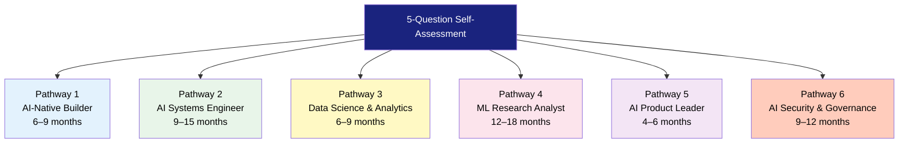

*48 modules · 8 categories · evidence-based progression · free audit resources*

---

# Part 3: What SrujanaBuddy Delivers

---

# For Students

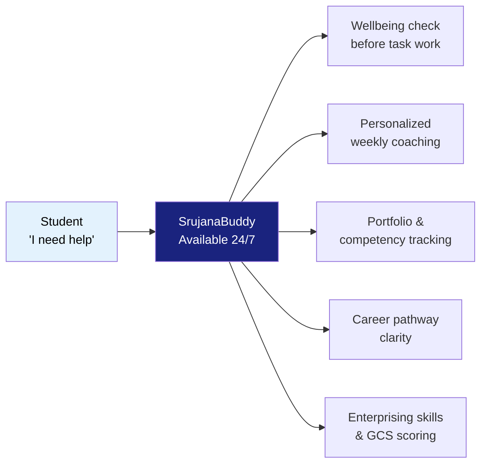

- **Always available** — 11 PM exam panic? Handled.
- **Culturally resonant** — Bangalore English, Kannada flavour, peer energy
- **Privacy-first** — consent-based sharing, student controls their data
- **Anti-substitution** — AI augments thinking; explain-back rule enforced

---

# For Faculty

| Before SrujanaBuddy | After SrujanaBuddy |
|--------------------|-------------------|
| Repetitive "where to start" questions | Students arrive with a plan |
| No visibility until exam failures | Early warning dashboard signals |
| 60 students, 30 minutes each = impossible | AI handles routine; faculty handle advanced |
| Mentoring minutes undocumented | Structured session logs (consent-based) |
| Subject coaching bottleneck | 10+ course coaches available per semester |

> 📌 *🖼️ INFOGRAPHIC PLACEHOLDER: Faculty time freed up → deep mentoring, research collaboration*

---

# For REVA as an Institution

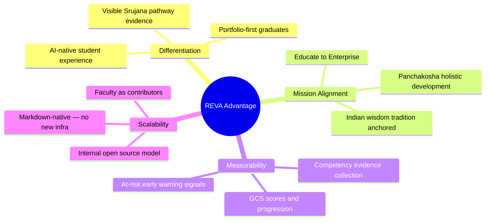

---

# Privacy, Safety & Guardrails

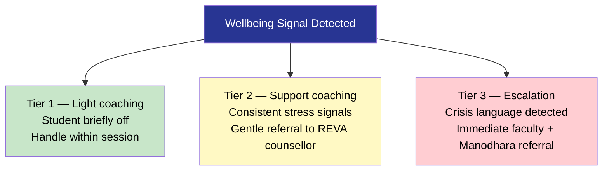

- **Student controls sharing** — 3 tiers of mentor visibility
- **Consent-based leaderboards** — opt-in only
- **Anti-brain-rot rule** — AI never writes essays or code for submission
- **Explain-back requirement** — student must be able to explain AI-assisted output

---

# The Numbers

| Metric | Value |
|--------|-------|
| Files in system | ~160 |
| Lines of coaching intelligence | ~15,000 |
| Specialist agents | 15 |
| AI Engineer pathways | 6 |
| Demo student personas | 10 |
| Domains covered | Learning · Career · Life Skills · Wellbeing · Enterprise |
| Infrastructure required | None — runs on existing IDE + GitHub |
| New software to install | None |

> 📌 *🖼️ MEME PLACEHOLDER: "No new servers. No new licenses. Just a text file that makes the AI brilliant."
(Suggest: "We have technology at home" meme — the technology is already here)*

---

# What Makes SrujanaBuddy Different

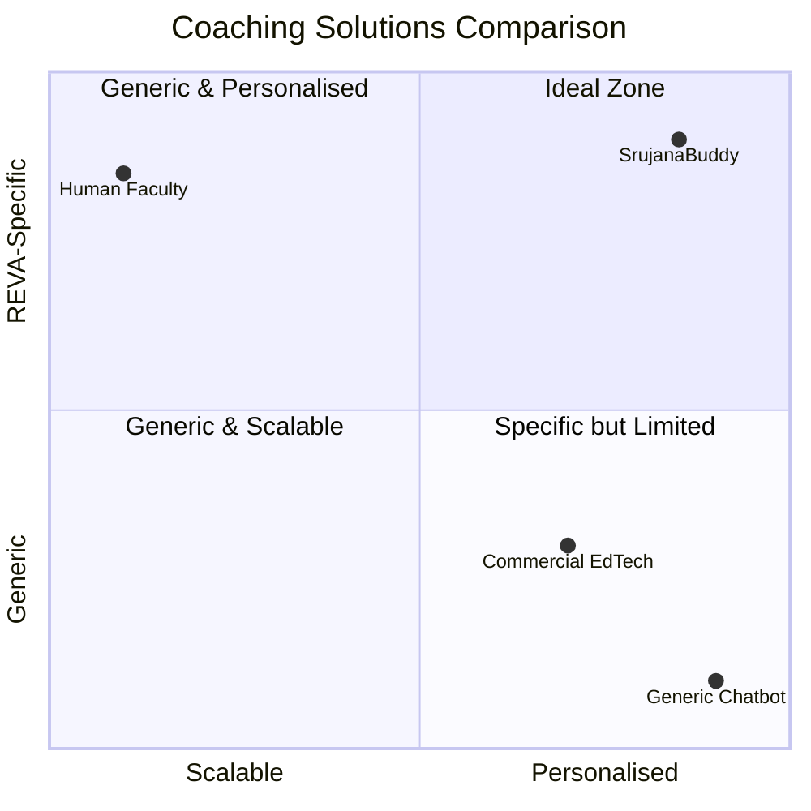

*SrujanaBuddy occupies the ideal zone: scalable AND REVA-specific AND personalised.*

---

# Part 4: Action Planning

## Beta Testers, Contributors & Next Steps

---

# The Ask — Be Part of History

> *"The best way to predict the future is to create it."* — Alan Kay

### We are looking for:

**Faculty Beta Testers (2–3 volunteers)**
- Use SrujanaBuddy alongside your existing mentoring
- Provide weekly feedback on student outcomes
- Help identify subject-specific coaching gaps

**Student Beta Testers (5–10 volunteers)**
- Commit to weekly coaching sessions for one semester
- Share anonymized progress signals (with consent)
- Help evolve the system through real use

**Faculty Contributors (1–2 per course)**
- Help build Course Buddy instances for your subject
- Co-author subject-specific knowledge base entries
- Become internal open source maintainers at REVA

---

# How to Contribute — No Tech Skills Needed

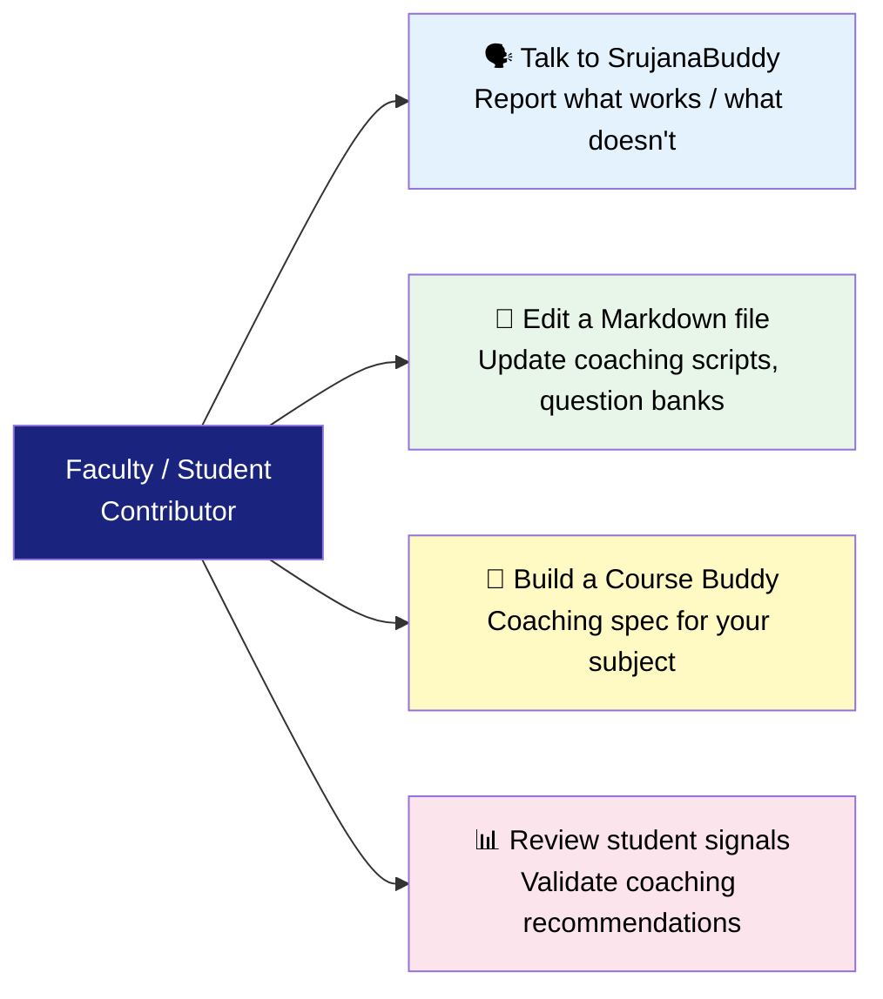

> **This is a Markdown-native system. If you can write an email, you can contribute.**
> The system lives on GitHub — every change is versioned, reviewed, and attributed.

---

# Rollout Roadmap

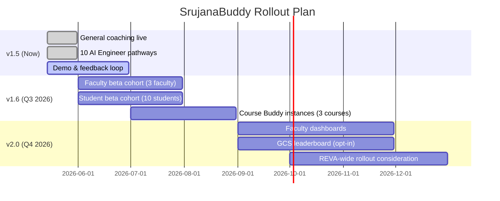

---

# Identify 2–3 Courses for v1.6

| Course Type | Why It Fits | Effort |
|-------------|-------------|--------|
| **Capstone Project** | Students need ongoing coaching, not one-off advice | Medium |
| **Research Methods / Dissertation** | Structured guidance is repeatable and scalable | Medium |
| **Internship Prep** | Clear milestones, portfolio checkpoints, placement coaching | Low |
| **AI/ML Foundation** | Already have AI Engineer pathway modules built | Low |
| **Life Skills / Soft Skills** | Five Spheres framework maps directly | Low |

> *Which courses would benefit most from 24/7 coaching support for your students?*

---

# Action Planning — Today's Commitments

| Who | Action | By When |
|-----|--------|---------|
| Faculty volunteers | Confirm beta testing interest | Today |
| Student nominees | Identify 5–10 beta testers | This week |
| Course selection | Nominate 2–3 courses for v1.6 | This week |
| Core team | Schedule onboarding session | Next week |
| All | Share this presentation | Today — GitHub link |

> 📌 *🖼️ IMAGE PLACEHOLDER: QR code linking to this presentation on GitHub
(URL: github.com/[org]/SrujanaBuddy/review/srujanabuddy-leadership-demo-v1.0.md)*

---

# Before We Open the Floor

### Quick show of hands:

1. **Which demo scenario did you find most relevant to your students?**

2. **Which T.R.A.C.K domain outside coaching interests you most?**
   *(Teaching / Research / Administration / Consulting / Kaizen)*

3. **Who wants to be a beta tester — faculty or student nominator?**

> *Your answers will shape v1.6 priorities.*

---

# Q&A

> 📌 *🖼️ IMAGE PLACEHOLDER: "No question is too basic" — open floor graphic*

### Anticipate these questions:

| Question | Short Answer |
|----------|-------------|
| "Is student data safe?" | Student-controlled, consent-based, no PII to external services |
| "Does it replace faculty?" | No — it handles routine so faculty handle advanced |
| "What if AI gives wrong advice?" | Faculty escalation triggers; all advice is explainable |
| "How much does it cost?" | Zero infrastructure cost — runs on existing tools |
| "Who maintains it?" | REVA contributors — internal open source model |
| "Is it ready now?" | 15,000 lines live; demo logs validated; beta-ready |

---

# ❝

> *"Education is not the filling of a pail,*
> *but the lighting of a fire."*
> — W.B. Yeats

**SrujanaBuddy exists to light that fire —**
**one student, one session, one small win at a time.**

---

# Thank You

**SrujanaBuddy — REVA University AI Coaching System**

📂 This presentation: `review/srujanabuddy-leadership-demo-v1.0.md`
🌐 Repository: `github.com/[org]/SrujanaBuddy`
📧 Core team: [add contact]

*Built with Markdown · Versioned on GitHub · Open for REVA contributors*

---

# Appendix: Full Demo Index

*Reference for facilitator — jump to any scenario as requested*

| File | Student | Key Capability |
|------|---------|---------------|
| [riya-sharma.md](../eval/demos/riya-sharma.md) | Riya — Exam panic | Wellbeing triage, Calm Queen |
| [arjun-patel.md](../eval/demos/arjun-patel.md) | Arjun — Career dilemma | Svadharma, pathway mapping |
| [keerthi-reddy.md](../eval/demos/keerthi-reddy.md) | Keerthi — Wants ML | Out-of-curriculum, AI pathways |
| [vikram-nair.md](../eval/demos/vikram-nair.md) | Vikram — Placement | Portfolio rescue, GTD |
| [sneha-kulkarni.md](../eval/demos/sneha-kulkarni.md) | Sneha — MBA strengths | Five Spheres, strengths |
| [rohit-joshi.md](../eval/demos/rohit-joshi.md) | Rohit — Website | Personal website agent |
| [ananya-rao.md](../eval/demos/ananya-rao.md) | Ananya — Startup | GCS scoring, 6 dimensions |
| [mohammed-faizan.md](../eval/demos/mohammed-faizan.md) | Faizan — Crisis re-entry | Wellbeing → academic plan |
| [priya-venkatesh.md](../eval/demos/priya-venkatesh.md) | Priya — GATE + PhD | Research pathway |
| [suresh-babu.md](../eval/demos/suresh-babu.md) | Suresh — Wrong branch | Svadharma reframe |
